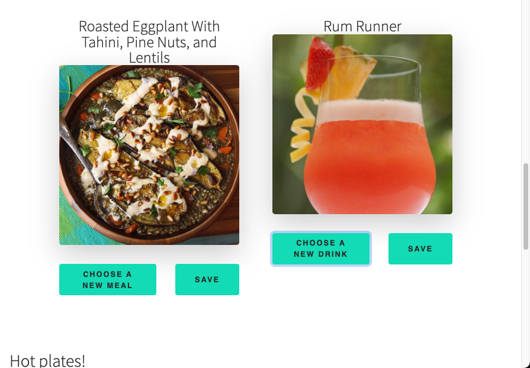

# Creative Meals
Creative Meals is a lightweight and simple single page application for randomly generating meal pairings. 

## Features
- **Responsive Design** scales based on viewport and has a mobile first design. 
- **Pesistant Data Storage** will keep your favorite meals and drinks stored even if you close the window or refresh the page. 

### Tech Used
Creative Meals was built using Bootstrap 5.1.3 (our new technology), jQuery 3.6, jQuery UI 1.13, TheMealDB api and the TheCocktailDB api. 

Create Meals was created as a joint project by Christian Carvajal, Karanbir Dhawan and Aaron Haag.